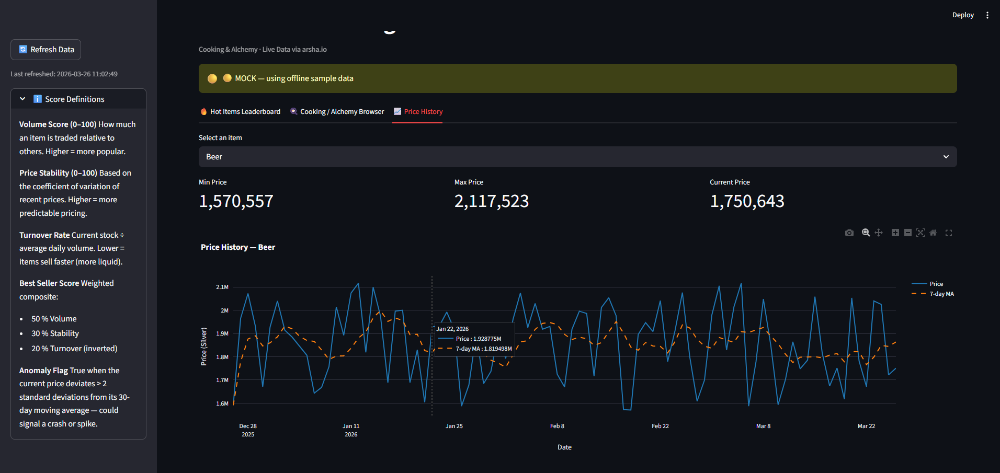

# BDO Market Intelligence — Phase 1

A Streamlit dashboard for analysing the Black Desert Online EU Central Market, focused on Cooking and Alchemy items.



## Quick Start

### 1. Clone / Open in PyCharm

Open the `bdo-analytics` project folder in PyCharm (or your editor of choice).

### 2. Create & Activate the Virtual Environment

```bash
# From the project root (bdo-analytics/)
python -m venv venv

# Windows
venv\Scripts\activate

# macOS / Linux
source venv/bin/activate
```

### 3. Install Dependencies

```bash
pip install -r requirements.txt
```

### 4. Run the Dashboard

```bash
# From the project root (bdo-analytics/)
streamlit run app.py
```

The dashboard will open in your browser at `http://localhost:8501`.

> Note: Streamlit apps should be started with `streamlit run`, not
> `python app.py`. If `python app.py` is used by mistake, the launcher prints
> the correct command and exits without the long Streamlit runtime warning
> output.

## Features

| Tab | What it shows |
|-----|---------------|
| **Hot Items Leaderboard** | Currently trending items across all categories, with anomaly highlighting |
| **Cooking / Alchemy Browser** | All Cooking & Alchemy items ranked by a composite Best Seller Score |
| **Price History** | Interactive price chart with 7-day moving average for any Cooking/Alchemy item |

## Score Glossary

| Score | Meaning | Why it matters for BDO players |
|-------|---------|-------------------------------|
| **Volume Score** (0–100) | How much an item is traded relative to others in the list | High-volume items are safer to invest in — they sell quickly |
| **Price Stability** (0–100) | Inverse of the coefficient of variation of recent prices | Stable items have predictable margins; volatile ones are riskier but can spike |
| **Turnover Rate** | Current stock ÷ average daily volume | Low turnover = items sell fast. Great for finding liquid markets |
| **Best Seller Score** | Weighted composite: 50% Volume + 30% Stability + 20% Turnover | A single number summarising how "hot" an item is overall |
| **Anomaly Flag** | True if current price deviates > 2σ from its 30-day moving average | Flags potential price crashes or spikes — worth investigating before buying |

## Data Source

All data comes from [arsha.io](https://arsha.io), a community-maintained proxy for the BDO Central Market API. No login or API key is required.

- API responses are cached locally for 15 minutes (in `data/cache/`)
- If arsha.io is unreachable, the dashboard falls back to realistic mock data so you can still explore the interface
- Some live EU endpoints can temporarily fail when Pearl Abyss blocks upstream
  requests through Imperva. This is an upstream data-source issue, not a missing
  API key.

## Project Structure

```
bdo-intelligence/
├── app.py                  # Streamlit dashboard
├── api/
│   └── market.py           # API wrapper with caching + mock fallback
├── analytics/
│   └── best_sellers.py     # Scoring and anomaly detection
├── data/
│   └── cache/              # Auto-generated JSON cache files
└── README.md
```

## Phase Roadmap

This is **Phase 1** of a 5-phase capstone project:

1. **Market Intelligence Dashboard** ← you are here
2. Enhancement Simulator
3. Arbitrage Finder
4. Anomaly Alerts
5. Full Capstone Platform
